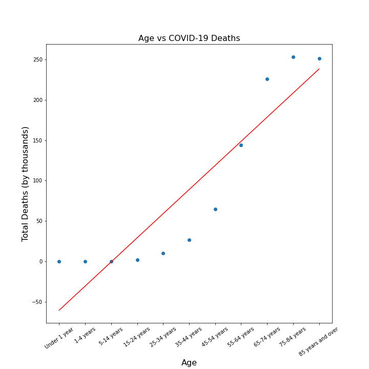
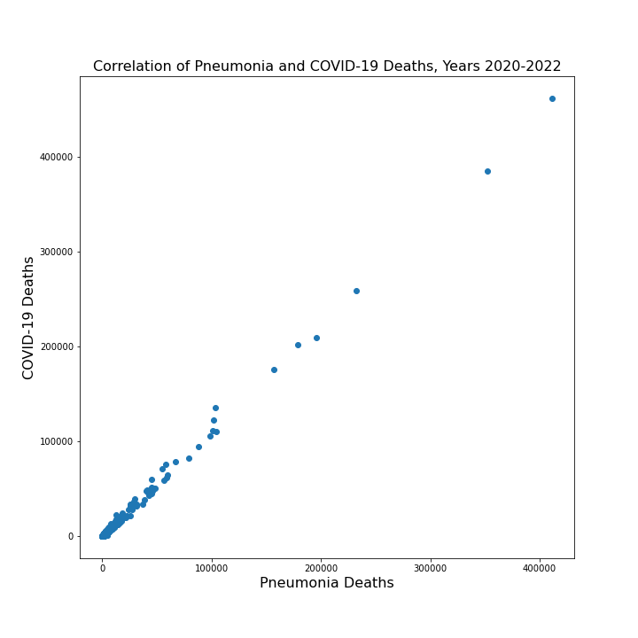
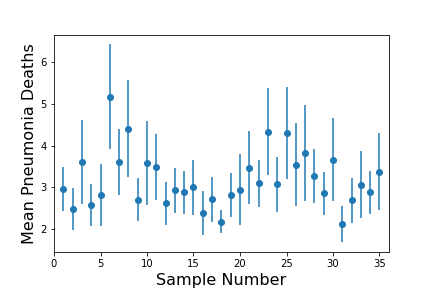

# Infection Data Analysis
# Vishaal Gupta, Lindsey Morales, Atika Hemani, Isaac Rosenthal
## Methods Used
Various Plotting Methods (Scatterplots & Barplots), Linear Regression, Data Visualization

## Technologies
Python, Matplotlib, Pandas, Seaborn, Numpy, Scipy.Stats

## Featured Notebooks and files
**CovidDeathRateAnalysis** 
- Using Pandas and visualization packages, to look at COVID-19, Influenza, and Pneumonia deaths in the US and Puerto Rico from 2020-2022. This notebook starts off by cleaning the data and exploring what variables we have. This data exploration helped with creating meaningful visualizations, in order to tell a story about COVID-19 and the differences & similarites with Influenza and Pneumonia. This is our final notebook.

**Resources Folder**

**Images**
- This folder holds all of our graphs we made in order to showcase our data. There a variety of different types of plots looking at various compenents of our dataset. 

**Provisional_COVID-19_Deaths_by_Sex_and_Age.csv**
- CSV file with our raw data. It looks at COVID-19, Influenza, and Pneumonia deaths by state, age group, gender, and month/year.

## Analysis and Observed Trends

**Correlation Graphs and Trends**

A strong correlation was observed between Age Groups & COVID-19 Deaths in the US. This suggests the older you are, the risk of dying from COVID-19 is higher. This makes sense due to comorbidities of other diseases and differences in immune systems.

A correlation coefficient of .724 was observed between Influenza & COVID-19 Deaths in the US

Additionally, a correlation coefficient of .9985 was observed between Influenza & COVID-19 Deaths of all the states in the US. This shows how severe both of these diseases are and how they ultimately lead to death if not treated.

The SEM value for the sample Influenza Deaths is 0.515

# Suggestions for Further Analysis
- Compare the deaths of COVID-19 looking at the lens of pre-vaccine and post-vaccine
- Additionally, using the information we have on COVID-19 Deaths for the US and compare this to another dataset looking at other countries
- Also, we could look at correlation of COVID-19 Deathas and red/blue states

